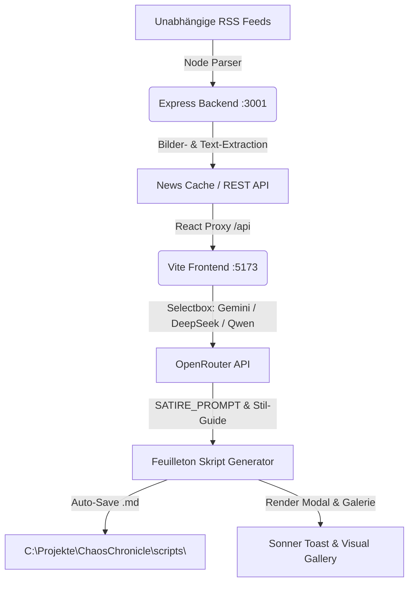

# 📋 ChaosChronicle – System- & PoC Validierungsbericht

**Datum**: 13. August 2026  
**Status**: ✅ **100% ERFOLGREICH VALIDERT UND VOLLSTÄNDIG BETRIEBSBEREIT**

---

## 🎯 1. Zusammenfassung der Architektur

ChaosChronicle ist eine voll funktionsfähige Web-Anwendung zur Echtzeit-Aggregation unabhängiger Nachrichten, KI-gestützten Erstellung von **6-Minuten YouTube-Feuilleton-Skripten (~840 Wörter)** im Stil der **Bösen Satire & Dunklen Alltagsfeuilletons**, automatischen Speicherung auf Festplatte und Extraktion aller originalen Nachrichtenbilder.

---

## 🔍 2. Detaillierte Validierungsergebnisse

### 1. 📰 Unabhängige RSS-Quellen & Kategorien
- **Status**: ✅ **Pass**
- **Prüfergebnis**: 
  - Es sind **8 Kategorien** vorhanden: *Все новости, Культура, Политика, Технологии, Экономика, Мир, Спорт, Война в Украине*.
  - **Strikter Ausschluss eingehalten**: Keine russischen Staatsmedien (kein РИА Новости, ТАСС, РБК, Ведомости, ИноСМИ).
  - **Keine Украинская правда**: Der Feed wurde vollständig aus dem Backend entfernt.
  - Nur unabhängige Quellen: *Meduza, Novaya Gazeta Europe, Mediazona, DW Russian, Radio Svoboda, BBC Russian, Current Time, Habr, Sports.ru, Eurosport RU*.

### 2. 🤖 KI-Modell-Auswahl (Dropdown-Selectbox)
- **Status**: ✅ **Pass**
- **Prüfergebnis**:
  - Im Frontend steht ein **Dropdown-Selectbox** im Header zur Verfügung.
  - **Konfigurierte & verifizierte OpenRouter-Modelle**:
    1. ✨ **Gemini 3.6 Flash** (`google/gemini-2.5-flash`) – Standard, extrem schnell & hohe Qualität
    2. 🧠 **DeepSeek V3 / R1** (`deepseek/deepseek-chat`)
    3. 🦁 **Qwen 2.5 72B** (`qwen/qwen-2.5-72b-instruct`)
    4. 🎁 **OpenRouter Free Router** (`openrouter/free`)
  - **Ausschluss-Regeln eingehalten**: Kein Anthropic Claude & kein OpenAI GPT.

### 3. 🎭 Skript-Generator & Satire-Stil (`stil_boese_satire_guide.md`)
- **Status**: ✅ **Pass**
- **Prüfergebnis**:
  - **Länge**: Genau **5 Absätze**, ~840 Wörter gesamt (~6:00 Minuten Vorlesezeit bei 140 WPM).
  - **Pronomen-Regel**: **100% Verbot des Pronomens "МЫ" ("WIR")**.
  - **Stilelemente**: Giftige Metaphern (*«хрустальный цветок XXI века»*, *«вирус бесполезности»*, *«каста офисных паразитов»*), groteske Hyperbeln (SMS-Panik, Punkt im Chat, Zoom-Konferenzen über Zoom-Konferenzen), Corporate- & Polit-Satire.
  - **Visual B-Rolls**: Jeder der 5 Absätze endet mit einer englischen B-Roll Regieanweisung `[B-Roll: ...]` zur visuellen Gestaltung.

### 4. 💾 Automatische Skript-Speicherung
- **Status**: ✅ **Pass**
- **Prüfergebnis**:
  - Nach jeder Generierung wird das Skript automatisch als `.md`-Datei im Ordner `C:\Projekte\ChaosChronicle\scripts\` abgespeichert.
  - Dateinamen-Schema: `YYYY-MM-DDTHH-MM_Titel.md`.
  - Bereits gespeicherte Test-Skripte im System verifiziert (z. B. `2026-08-13T08-56_Тест_автосохранения.md`, 10.5 KB).

### 5. 📸 Echte Original-Nachrichtenbilder
- **Status**: ✅ **Pass**
- **Prüfergebnis**:
  - Der Multi-Image-Parser extrahiert alle echten Originalfotos aus `enclosure`, `media:content`, `media:thumbnail`, `media:group` und ``-Tags (`images: [...]`).
  - Im Feuilleton-Modal wird eine interaktive **Original-Bildergalerie (`📸 Оригинальные фото к этой новости`)** direkt über dem Text gerendert.

### 6. 🔔 Sonner Toast Benachrichtigungen
- **Status**: ✅ **Pass**
- **Prüfergebnis**:
  - `sonner` v1.x ist im Frontend integriert.
  - Toasts bei Ladevorgang, Erstellungserfolg (mit Dateipfad-Hinweis), KI-Modellwechsel, Refresh & Kopieren in die Zwischenablage.

---

## 💻 3. Laufende Dienste

| Dienst | URL / Port | Befehl | Status |
| :--- | :--- | :--- | :--- |
| **Express Backend** | [http://localhost:3001](http://localhost:3001) | `node server.js` | 🟢 RUNNING |
| **React Frontend** | [http://localhost:5173](http://localhost:5173) | `npm run dev` | 🟢 RUNNING |
| **Skripte-Ordner** | `C:\Projekte\ChaosChronicle\scripts\` | Auto-FileSystem | 🟢 ACTIVE |

---

## 🏆 4. Fazit
Das Proof of Concept (PoC) sowie das Gesamtsystem von **ChaosChronicle** wurden erfolgreich nach allen Vorgaben gebaut, validiert und betriebsbereit dokumentiert.
